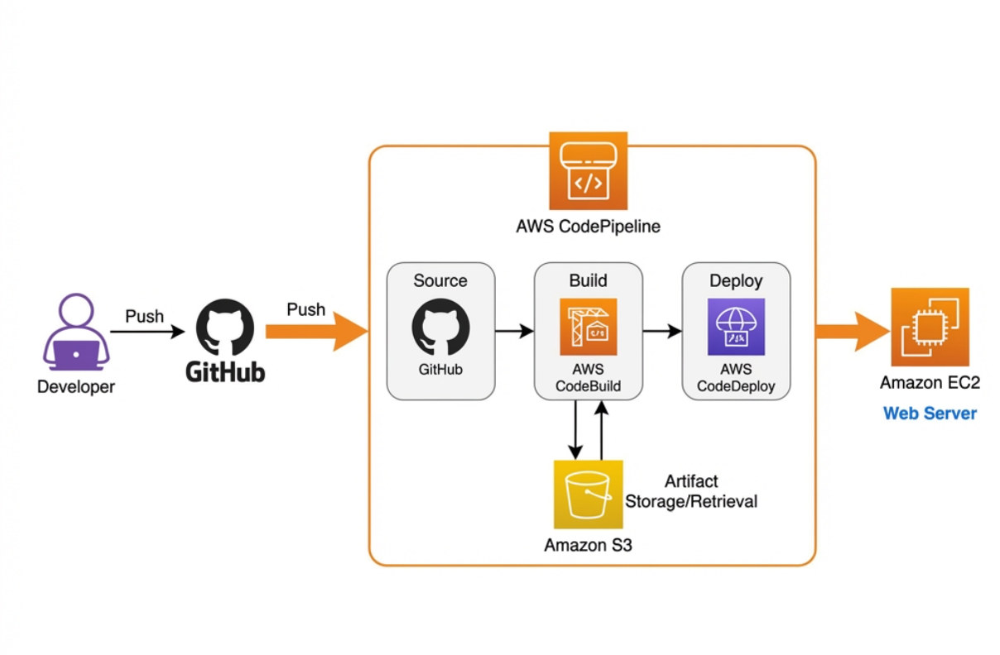

# Project 1: End-to-End CI/CD Pipeline on AWS

## Project Overview
This project automates the entire software release process using AWS native DevOps tools. It establishes a robust **Continuous Integration and Continuous Deployment (CI/CD)** pipeline that listens for code changes on GitHub, automatically builds and tests the application, and deploys the new version to a live EC2 server without manual intervention.

## 🎯 Target Audience
*   **Startup Founders & CTOs**: Who need a reliable, automated way to ship features to customers fast without hiring a dedicated DevOps engineer.
*   **Software Development Teams**: Who want to stop wasting time on manual deployments and "works on my machine" bugs.
*   **Enterprises**: Looking to modernize their legacy deployment checklists into codified, auditable pipelines.

## 💎 Value & Benefits
*   **Zero Downtime**: Automated deployments reduce the risk of human error breaking production.
*   **Faster Time-to-Market**: Developers can push code and have it live in minutes, not days.
*   **Cost Efficiency**: Uses ephemeral build servers (CodeBuild) and standard EC2 instances, minimizing idle resource costs.
*   **Scalability**: The pipeline architecture handles high-frequency commits and can be easily replicated for Staging/Prod environments.

## 🚀 Problem Solved
**The Problem**: Manual deployments are slow, error-prone, and risky. Developers often forget configuration steps, dependencies fail to install, or bad code reaches production because it wasn't tested automatically.
**The Solution**: This pipeline eliminates manual work. Every commit is automatically:
1.  **Verified**: Unit tests run immediately in an isolated environment.
2.  **Built**: Dependencies are installed and packaged cleanly.
3.  **Deployed**: The artifact is moved to the server and restarted gracefully.
If any step fails, the process stops, preventing broken code from ever reaching the users.

## 🏗️ Architecture Diagram 

<p align="center">
  
</p>

## Architecture & Services
* **Source**: GitHub (connected via AWS CodeStar)
* **Build**: AWS CodeBuild (runs unit tests, produces artifacts)
* **Deploy**: AWS CodeDeploy (deploys to EC2)
* **Orchestration**: AWS CodePipeline
* **Infrastructure**: Provisioned via Terraform
* **Compute**: EC2 (Amazon Linux 2023)
* **Storage**: S3 (Artifacts)
* **Security**: IAM Roles (Least Privilege)

## Project Structure
```text
aws-cicd-pipeline/
├── index.js                # Sample Node.js App
├── buildspec.yml           # CodeBuild instructions
├── appspec.yml             # CodeDeploy instructions
├── scripts/                # Deployment scripts (Stop, Install, Start)
└── terraform/              # Infrastructure as Code
    ├── pipeline.tf         # CodePipeline, CodeBuild, CodeDeploy resources
    ├── ec2.tf              # EC2 Instance & Security Groups
    ├── iam.tf              # IAM Roles & Policies
    ├── s3.tf               # S3 Bucket for Artifacts
    └── provider.tf         # AWS Provider
```

## Setup Instructions

### Prerequisites
* AWS Account
* GitHub Account
* Terraform installed
* AWS CLI configured

### 1. GitHub Setup
1. Create a new repository on GitHub (e.g., `aws-cicd-demo`).
2. Push this code to the repository:
   ```bash
   git init
   git add .
   git commit -m "Initial commit"
   git branch -M main
   git remote add origin https://github.com/YOUR_USERNAME/aws-cicd-demo.git
   git push -u origin main
   ```

### 2. AWS CodeStar Connection
1. Go to **AWS Console** > **Developer Tools** > **Settings** > **Connections**.
2. Create a connection (Select GitHub) and authorize it.
3. Copy the **Connection ARN**.

### 3. Deploy Infrastructure
1. Navigate to the terraform directory:
   ```bash
   cd terraform
   ```
2. Initialize and Apply:
   ```bash
   terraform init
   terraform apply
   ```
3. Provide the requested variables:
   * `github_repo_owner`: Your GitHub username
   * `github_repo_name`: Your repo name
   * `codestar_connection_arn`: The ARN from Step 2

## Usage
Once deployed, the pipeline will automatically trigger. You can view the pipeline progress in the AWS CodePipeline Console.
The application will be accessible at the EC2 instance's Public IP on port 3000.
